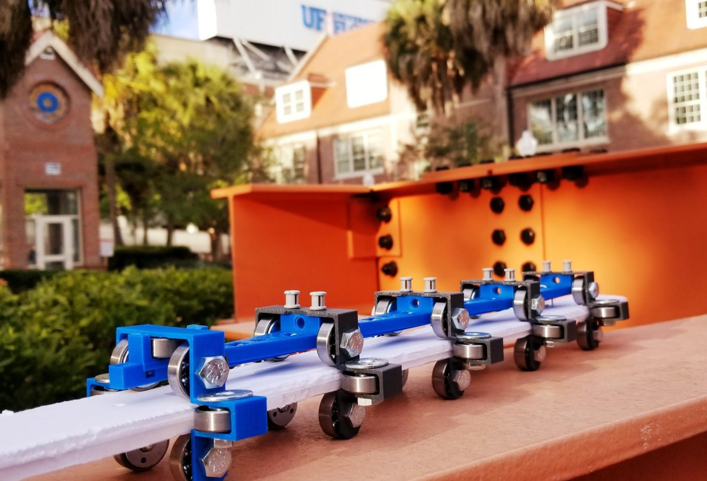

# TPEDCoasterControlsFall2019

This Repository is dedicated to the controls team for the UF Theme Park Engineering and Design Club. 
Within this project we our designing a small-scale working model of a roller coaster that we designed 
and built from scratch.

<h2>Things to do:</h2>
-Completed-Create a diagram to show how the controls system will run 
-Completed-Develop prgram to handle one train 
-Completed-Test Sensors with one train 
-Completed-Develop prgram to handle multiple trains 
-Completed-Test Sensors with multiple trains 
-Completed-Write the software to run motors 
-Completed-write software for different modes 
-In Progress-Write the software to switch modes 
-In Progress-Add more sensors to add safety redundency  
-In Progress-Develop design for control box 
-Buy buttons 
-Test the system to ensure everything works 
-Create a separate program that will operate show equipment (LEDs, Sounds etc) 
-Make TPED Website 
-Make TPED App 

<h3>Different Modes</h3>
-Display Mode- Will continue to run for a given amount of time with no action needed 
-Manual Mode- Will only allow the next coaster to go when an input is given 
-Maintnance Mode-Will turn on specific motors on comand 

<h2>Getting Started?</h2>
Here are some things to download before working on programming the logic behind the coaster. 
To be able to push and pull from this repository to your local machine we use git and gitBash 
https://git-scm.com/downloads 
once you download git you could then create a folder for your TPED files, rightclick inside the folder and select "Git Bash Here". With your GitHub username and email fill in the following command:  
git config --global user.name "Your name here" 
git config --global user.email "your_email@example.com"  
At this point you can now clone the repository onto your local machine using the link from this page when clicking the green button and the following command:  
git clone HTTP_URL_FROM_GREEN_BUTTON  
Now you have all the files we have been working on.
next we will need to download the IDE for arduino to be able to run are program 
https://www.arduino.cc/en/Main/Software  

Design Team DropBox 
https://www.dropbox.com/sh/4a9rzsodvtuo00k/AAD096ctILZ8-KGnmdUy5A3Wa?dl=0
